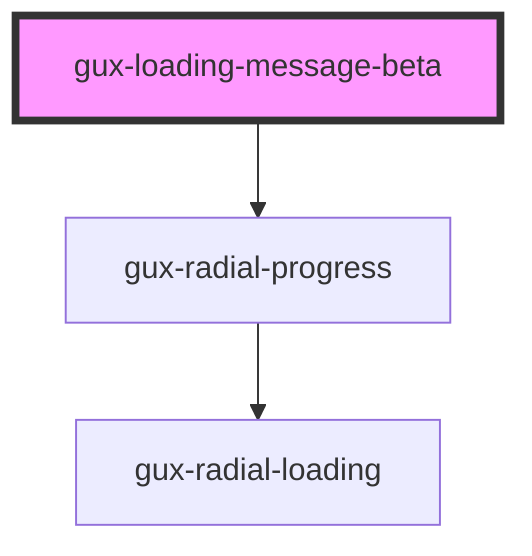

# gux-loading-beta

<!-- Auto Generated Below -->

## Properties

| Property   | Attribute   | Description | Type                             | Default     |
| ---------- | ----------- | ----------- | -------------------------------- | ----------- |
| `maxValue` | `max-value` |             | `number`                         | `undefined` |
| `size`     | `size`      |             | `"large" \| "medium" \| "small"` | `'medium'`  |
| `value`    | `value`     |             | `number`                         | `undefined` |

## Dependencies

### Depends on

- [gux-radial-progress](../../stable/gux-radial-progress)

### Graph

----------------------------------------------

*Built with [StencilJS](https://stenciljs.com/)*
