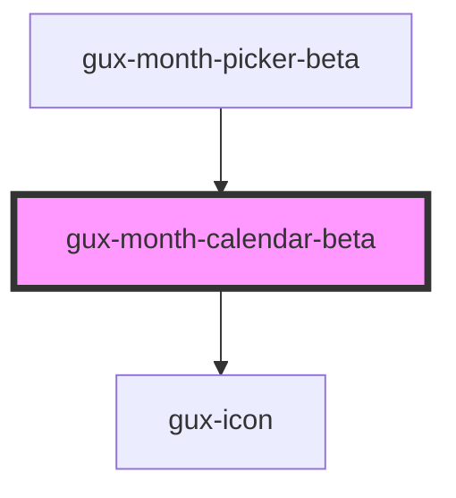

# gux-month-calendar-beta

<!-- Auto Generated Below -->

## Properties

| Property  | Attribute  | Description                         | Type     | Default |
| --------- | ---------- | ----------------------------------- | -------- | ------- |
| `maxDate` | `max-date` | The max date selectable             | `string` | `''`    |
| `minDate` | `min-date` | The min date selectable             | `string` | `''`    |
| `value`   | `value`    | The current selected year and month | `string` | `''`    |

## Events

| Event   | Description                         | Type                  |
| ------- | ----------------------------------- | --------------------- |
| `input` | Triggered when user selects a month | `CustomEvent<string>` |

## Methods

### `focusPreviewMonth() => Promise<void>`

Focus the preview date

#### Returns

Type: `Promise<void>`

### `resetCalendarView() => Promise<void>`

Reset calendar view to show first selected date

#### Returns

Type: `Promise<void>`

### `setValue(value: string) => Promise<void>`

Sets new value

#### Returns

Type: `Promise<void>`

## Dependencies

### Used by

 - [gux-month-picker-beta](../gux-month-picker)

### Depends on

- [gux-icon](../../stable/gux-icon)

### Graph

----------------------------------------------

*Built with [StencilJS](https://stenciljs.com/)*
