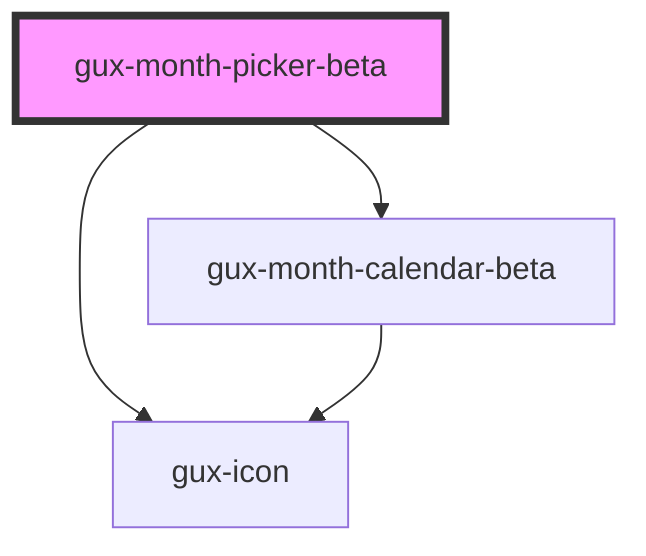

# gux-month-picker

<!-- Auto Generated Below -->

## Properties

| Property   | Attribute  | Description                                     | Type      | Default     |
| ---------- | ---------- | ----------------------------------------------- | --------- | ----------- |
| `disabled` | `disabled` | Indicate if the month picker is disabled or not | `boolean` | `false`     |
| `label`    | `label`    |                                                 | `string`  | `undefined` |
| `maxDate`  | `max-date` | The max date selectable                         | `string`  | `''`        |
| `minDate`  | `min-date` | The min date selectable                         | `string`  | `''`        |
| `value`    | `value`    | The month picker current value                  | `string`  | `''`        |

## Events

| Event   | Description                         | Type                  |
| ------- | ----------------------------------- | --------------------- |
| `input` | Triggered when user selects a month | `CustomEvent<string>` |

## Dependencies

### Depends on

- [gux-icon](../../stable/gux-icon)
- [gux-month-calendar-beta](../gux-month-calendar)

### Graph

----------------------------------------------

*Built with [StencilJS](https://stenciljs.com/)*
