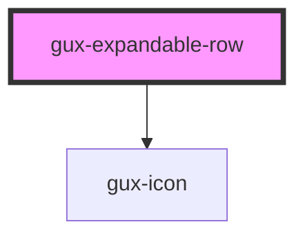

# gux-expandable-row

<!-- Auto Generated Below -->

## Properties

| Property   | Attribute  | Description | Type      | Default     |
| ---------- | ---------- | ----------- | --------- | ----------- |
| `expanded` | `expanded` |             | `boolean` | `undefined` |
| `rows`     | `rows`     |             | `string`  | `undefined` |

## Events

| Event          | Description                                                        | Type                                    |
| -------------- | ------------------------------------------------------------------ | --------------------------------------- |
| `guxexpandrow` | Triggers when a table row with a nested expandable-row is clicked. | `CustomEvent<GuxTableExpandedRowState>` |

## Dependencies

### Depends on

- [gux-icon](../../../stable/gux-icon)

### Graph

----------------------------------------------

*Built with [StencilJS](https://stenciljs.com/)*
