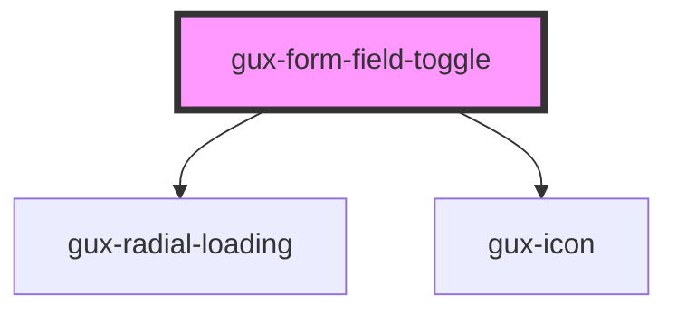

# gux-form-field-toggle

<!-- Auto Generated Below -->

## Properties

| Property         | Attribute         | Description | Type                | Default     |
| ---------------- | ----------------- | ----------- | ------------------- | ----------- |
| `checkedLabel`   | `checked-label`   |             | `string`            | `undefined` |
| `labelPosition`  | `label-position`  |             | `"left" \| "right"` | `'right'`   |
| `loading`        | `loading`         |             | `boolean`           | `false`     |
| `uncheckedLabel` | `unchecked-label` |             | `string`            | `undefined` |

## Events

| Event   | Description | Type                   |
| ------- | ----------- | ---------------------- |
| `check` |             | `CustomEvent<boolean>` |

## Slots

| Slot      | Description                     |
| --------- | ------------------------------- |
| `"error"` | Optional slot for error message |
| `"input"` | Required slot for input tag     |
| `"label"` | Required slot for label tag     |

## Dependencies

### Depends on

- [gux-radial-loading](../../../gux-radial-loading)
- [gux-icon](../../../gux-icon)

### Graph

----------------------------------------------

*Built with [StencilJS](https://stenciljs.com/)*
